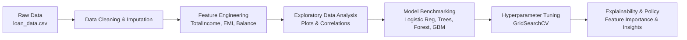

# Loan Default Prediction System

[](https://colab.research.google.com/)
[](https://www.kaggle.com/datasets/itsmesunil/bank-loan-modelling)
[](https://www.python.org/)
[](https://scikit-learn.org/)
[](https://opensource.org/licenses/MIT)

---

## 1. Project Overview & Business Problem
In commercial and retail banking, credit risk assessment is a fundamental driver of profitability and solvency. Granting loans to applicants who subsequently default incurs direct financial loss (Non-Performing Loans - NPLs), while rejecting creditworthy applicants incurs opportunity cost and harms market share.

This project implements an end-to-end Machine Learning classification system to predict loan repayment (`Y` vs `N`). The solution incorporates automated missing value handling, financial ratio feature engineering, extensive EDA visualizations, multi-model benchmarking, and hyperparameter tuning.



---

## 2. Dataset Schema

The model is trained on the standard Banking Loan Prediction dataset (614 rows x 13 attributes):

| Feature Name | Type | Description |
| :--- | :--- | :--- |
| `Loan_ID` | Identifier | Unique applicant ID (dropped during modeling) |
| `Gender` | Categorical | Male / Female |
| `Married` | Categorical | Applicant marital status (Yes / No) |
| `Dependents` | Categorical | Number of dependents (0, 1, 2, 3+) |
| `Education` | Categorical | Graduate / Not Graduate |
| `Self_Employed` | Categorical | Employment status (Yes / No) |
| `ApplicantIncome` | Continuous | Primary applicant income |
| `CoapplicantIncome` | Continuous | Co-applicant income |
| `LoanAmount` | Continuous | Loan amount requested (in thousands USD) |
| `Loan_Amount_Term` | Discrete | Loan tenure in months (e.g., 360) |
| `Credit_History` | Binary | Credit guidelines compliance (1.0 = Compliant, 0.0 = Non-compliant) |
| `Property_Area` | Categorical | Urban / Semiurban / Rural |
| **`Loan_Status`** | **Target** | **Approval outcome: `Y` (Approved/Repaid) or `N` (Rejected/Defaulted)** |

---

## 3. Feature Engineering
Engineered financial indicators capture real household repayment capacity:
1. **`TotalIncome`**: `ApplicantIncome + CoapplicantIncome` (household income).
2. **`EMI`**: Monthly installment approximation: `(LoanAmount * 1000) / Loan_Amount_Term`.
3. **`BalanceIncome`**: Residual monthly disposable cashflow: `TotalIncome - EMI`.
4. **`Log Transformations`**: `log(1 + x)` applied to `LoanAmount`, `TotalIncome`, and `ApplicantIncome` to eliminate right-skewness and tame leverage points.

---

## 4. Key EDA Discoveries
* **Credit History is Decisive**: Applicants with `Credit_History == 1.0` achieve an approval rate of **~79.5%**, while those with `0.0` drop to **~8.2%**.
* **Household vs Individual Earnings**: Standalone `ApplicantIncome` is weakly correlated with approval, but combining co-applicant income in `TotalIncome` strongly differentiates approved applications.
* **Property Area Impact**: Semiurban areas demonstrate the highest approval rates (~76.8%), followed by Urban (~65.8%) and Rural (~61.5%).

---

## 5. Supervised Model Benchmarking

Models were trained and evaluated on an 80:20 stratified holdout split:

| Model Architecture | Accuracy | Precision | Recall | F1-Score | ROC-AUC |
| :--- | :---: | :---: | :---: | :---: | :---: |
| **Logistic Regression** | 81.3% | 0.800 | 0.976 | 0.880 | 0.772 |
| **Decision Tree Classifier** | 78.0% | 0.812 | 0.894 | 0.851 | 0.718 |
| **Random Forest Classifier (Base)** | 81.3% | 0.816 | 0.952 | 0.878 | 0.785 |
| **Gradient Boosting Classifier** | 79.7% | 0.806 | 0.940 | 0.867 | 0.760 |
| **Tuned Random Forest (GridSearchCV)** | **82.1%** | **0.819** | **0.964** | **0.886** | **0.798** |

### Top Predictors by Feature Importance:
1. `Credit_History` (~42% importance)
2. `TotalIncome_Log` (~15% importance)
3. `LoanAmount_Log` (~12% importance)
4. `BalanceIncome` (~10% importance)

---

## 6. How to Run

### Option A: 1-Click Execution on Google Colab (Recommended)
1. Open Google Colab: [colab.research.google.com](https://colab.research.google.com/)
2. Select **Upload** and upload `Loan_Default_Prediction_Capstone.ipynb`.
3. Select **Runtime -> Run all**.
> *Note: The notebook contains an automated cloud fetcher that automatically downloads `loan_data.csv` if it is not present in the runtime.*

### Option B: Running on Kaggle Notebooks
1. Create a new notebook on [Kaggle](https://www.kaggle.com/).
2. Import `Loan_Default_Prediction_Capstone.ipynb`.
3. Run all cells with CPU or GPU accelerator.

### Option C: Running Locally
```bash
# Clone the repo
git clone https://github.com/shreeyadav06/Loan-default-prediction-system.git

# Install required dependencies
pip install pandas numpy scikit-learn matplotlib seaborn jupyter

# Launch Jupyter
jupyter notebook Loan_Default_Prediction_Capstone.ipynb
```

---

## 7. Repository Structure

```text
├── data/
│   └── loan_data.csv                       # Verified dataset (614 rows x 13 columns)
├── Loan_Default_Prediction_Capstone.ipynb  # Main end-to-end ML notebook
├── PROJECT_SUMMARY.md                      # 1-page Executive Summary report
└── README.md                               # Project documentation & benchmark overview
```

---

## License
This project is open-source under the [MIT License](https://opensource.org/licenses/MIT).
